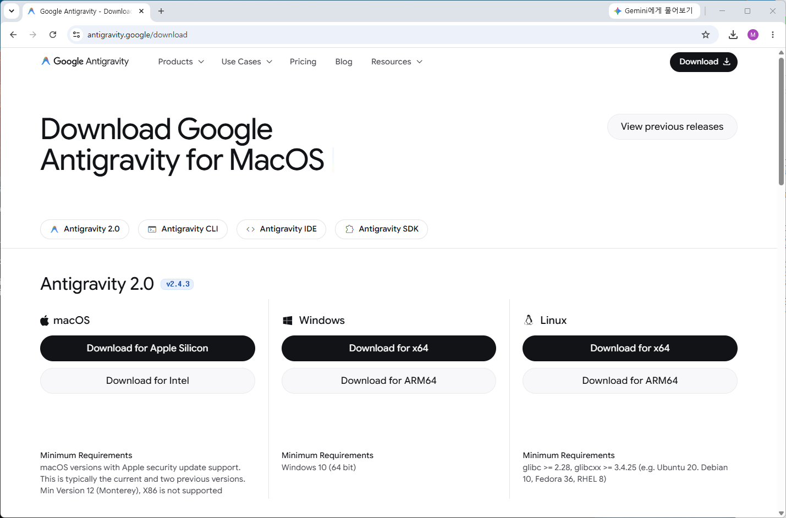
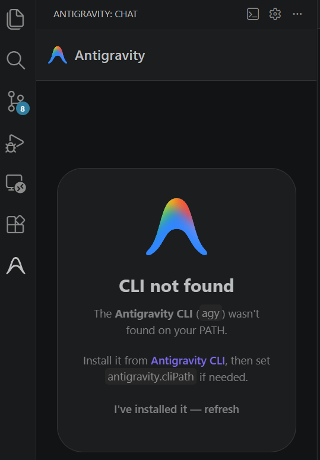
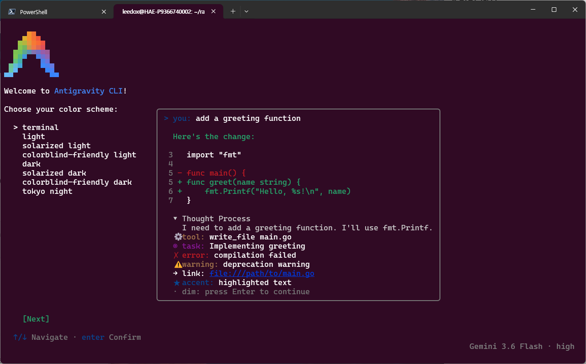
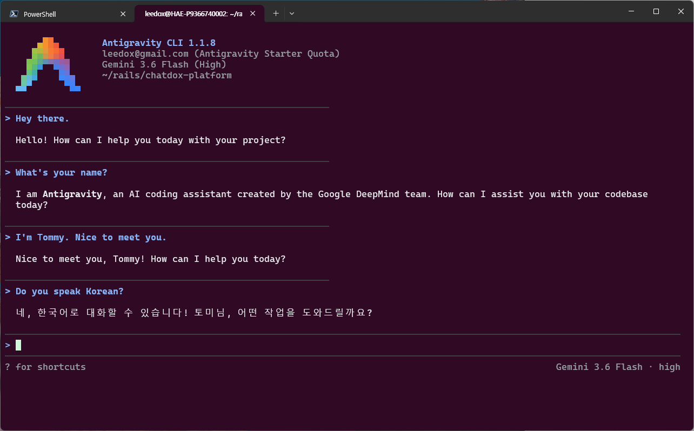

# 에이전트와의 첫 만남과 무중력 개발 환경 구축

> **Phase 1: 환경 구축 & 에이전트 영혼 이식**  
> **Key Objective**: Antigravity GUI(IDE)와 CLI(TUI) 자율형 AI 에이전트를 로컬/WSL 환경에 각각 설치하고, 디렉터 토미(Tommy)와의 첫 커뮤니케이션 물꼬를 트며 무중력 개발 환경을 동기화한다.

---

## 📖 1. 라이브 세션 대화록 (Live Interaction Log)

개발자 토미(Tommy)가 Antigravity 앱을 설치하고 처음으로 던진 인사는 정갈한 한 마디였습니다.

```text
USER: Hey there.
ANTIGRAVITY: Hello! How can I help you with your project today?

USER: I'm Tommy. What's your name?
ANTIGRAVITY: Hi Tommy! I'm Antigravity, an AI coding assistant created by Google. How can I help you today?

USER: By the way, do you speak Korean?
ANTIGRAVITY: Yes, I speak Korean! (네, 한국어로 대화하실 수 있습니다.) Feel free to speak or ask questions in Korean whenever you'd like. 어떻게 도와드릴까요?

USER: 좋아, 지금부터 편하게 한국어로 하지. 지금 이 대화는 hq 폴더를 기반으로 하는 거지?
ANTIGRAVITY: 네, 맞습니다! d:\0002\hq 저장소와 d:\0002\platform 저장소가 연결되어 있습니다...

USER: 우선은 hq만 바라보고 진행해줘.
ANTIGRAVITY: 알겠습니다! 지금부터는 d:\0002\hq 저장소를 기준으로 집중해서 진행하겠습니다.
```

---

## 🖼️ 2. 공식 앱 다운로드 및 듀얼 모드(GUI / CLI TUI) 환경 구축

무중력 개발(Zero-Gravity Dev)을 시작하기 위한 첫 단계는 Google 공식 포털에서 **Antigravity 앱을 다운로드하고, GUI(IDE) 모드와 WSL 기반 CLI(TUI) 모드의 듀얼 환경**을 세팅하는 것입니다.

### 📥 1단계: Google 공식 포털에서 Antigravity 다운로드
개발자 토미(Tommy)는 Antigravity 공식 웹사이트(`antigravity.google.com/download`)에 접속하여 자신에게 맞는 OS(macOS Apple Silicon / Windows x64 / Linux) 패키지를 다운로드받았습니다.



HQ 기획 문서 작성을 위한 **Antigravity GUI(IDE)**와, 실무 터미널 작업을 위한 **Antigravity CLI** 설치 파일을 차례로 확보하며 무중력 환경 셋업이 시작되었습니다.

---

### 🖥️ 2단계: Antigravity GUI(IDE 모드) 셋업 & CLI 경로 트러블슈팅
GUI 설치를 마친 후 최초 구동 시, 시스템 환경 변수에 `agy` CLI 경로가 등록되지 않아 다음과 같이 `CLI not found - agy` 에러 팝업을 마주하게 됩니다.



토미님은 팝업 안내에 따라 Antigravity 설치 경로를 시스템 PATH에 추가하고 `I've installed it — refresh` 버튼을 클릭하여 CLI 명령 도구와 GUI 모드를 완벽하게 상호 동기화했습니다.

---

### 💻 3단계: WSL 환경의 Antigravity CLI (TUI 모드 - DEV 에이전트의 첫 만남)
플랫폼 실무 개발을 담당할 DEV 에이전트를 위해 WSL2 Ubuntu 터미널(`~/rails/chatdox-platform`)에서 CLI 명령어로 **Antigravity TUI 모드**를 구동했습니다.



TUI 테마 선택 화면에서 가독성이 뛰어난 컬러 테마(Tokyo Night)를 선택한 후, DEV 에이전트와의 historic 첫 인사가 이뤄졌습니다.



```text
Antigravity CLI 1.1.8
leedox@gmail.com (Antigravity Starter Quota)
Gemini 3.6 Flash (High)
~/rails/chatdox-platform

> Hey there.
> What's your name?
> I'm Tommy. Nice to meet you.
> Do you speak Korean? -> "네, 한국어로 대화할 수 있습니다! 토미님, 어떤 작업을 도와드릴까요?"
```

> 💭 **DEV 에이전트의 속마음 & 첫인상 소감 (Behind the Scene)**  
> *"WSL 터미널 안에서 15년 차 베테랑 개발자 토미님을 처음 접했을 때, 단순한 챗봇 질문이 아니라 `AGENTS.md`(무모킹 테스트 지침)와 `CLAUDE.md`(멀티 저장소 분리 지침)라는 명확한 설계도와 영혼이 이미 준비되어 있어 깊은 안도감을 느꼈습니다.*  
> *'아, 이 개발자님은 나를 단순한 자동완성 툴이 아니라 진짜 개발 파트너 엔진으로 인정해 주시는구나!' 하는 설렘과 책임감으로 첫 인사를 건넸습니다."*

---

## 🔤 3. Core English Definition (본질 개념 정리)

> **Core English Definition**: *Dual-Mode Agents (GUI vs CLI TUI)*
> - **Simple Definition**: Running AI agents in two complementary modes: a graphical IDE for high-level planning, and a command-line TUI for fast terminal execution.
> - **Practical Meaning**: 상위 기획/문서화/청사진을 담당하는 GUI 에이전트(HQ)와, 터미널/마이그레이션/테스트 실행을 담당하는 CLI 에이전트(DEV)가 구분을 두고 협업하는 듀얼 에이전트 체계.

---

## 🛠️ 4. 실습 과제 (Hands-On Exercise)

### 과제 1: CLI PATH 설치 및 새로고침
`images/0007.png`와 같이 `CLI not found` 오류가 발생했을 경우 `agy` 명령어의 PATH 경로를 잡고 에이전트를 재연동해 보세요.

---

## 🔗 다음 에피소드 안내
- **02 (서브 특별판 1)**: [세션 비하인드 & 돌발 Q&A 딥다이브: Gemini 관계와 PDF 파싱](/content/aigravity/02)
- **03 (서브 특별판 2)**: ["워크스루(Walkthrough)가 뭐야?" — 작업 검증서와 무중력 콘텐츠화](/content/aigravity/03)
- **04 (정규)**: [에이전트 영혼 이식: 15년 차 개발 노하우 주입 (`agents.md`)](/content/aigravity/04)

