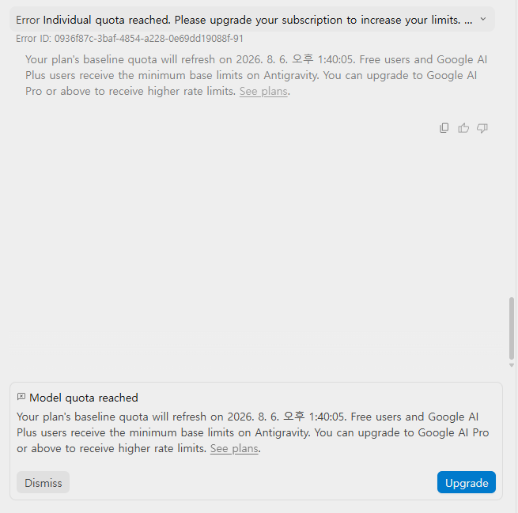
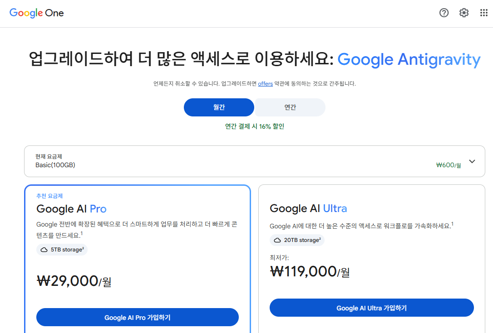
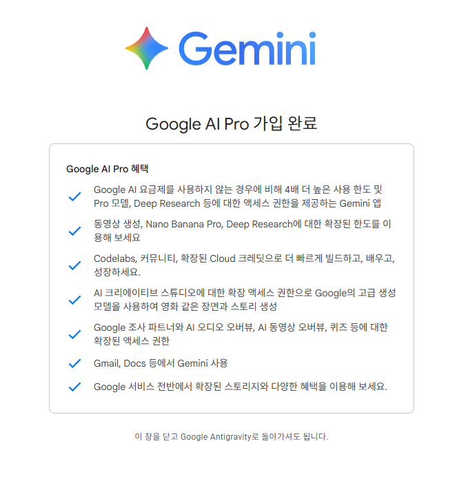

# 토큰 경제학과 비용 최적화: 무료 플랜부터 Pro까지

> **Phase 2: 컨텍스트 주입 & 토큰 경제학**  
> **Key Objective**: Antigravity 사용 중 무료 플랜에서 직면하는 쿼터 초과 에러(Model quota reached)를 분석하고, Google AI Pro(₩29,000/월) 결제 및 4배 사용 한도 해금 프로세스를 통해 비용 대비 최대의 무중력 개발 효율을 달성한다.

---

## 📖 1. 실전 쿼터 초과와 요금제 분석 (Real-World Quota & Pricing)

Antigravity를 사용하다 보면 무료 플랜(Free Tier)이나 기본 플랜에서는 대화 및 파일 읽기량이 누적되면서 다음과 같은 쿼터 초과 에러 메시지를 만나게 됩니다.

- **에러 메시지**: `Error: Individual quota reached. Model quota reached. Your plan's baseline quota will refresh on 2026. 8. 6...`
- **원인**: 대용량 파일 읽기 및 연속된 프롬프트로 인해 모델의 기한 내 호출 사용 한도(Rate Limit)에 도달함.

---

## 💳 2. Google AI Pro 요금제 비교 및 결제 (₩29,000/월)

유저들이 가장 민감하게 생각하는 **실제 비용 대비 가치**를 비교합니다.

| 요금제 | 월 비용 | 핵심 혜택 및 Antigravity 한도 | 비고 |
| :--- | :--- | :--- | :--- |
| **Basic** | ₩600/월 | 기본 100GB 스토리지, 최소 한도 제공 | 단순 체험용 |
| **Google AI Pro** | **₩29,000/월** *(추천)* | **무료 대비 4배 높은 사용 한도**, Pro 모델 액세스, 5TB 스토리지 | **실무 개발자 필수** |
| **Google AI Ultra** | ₩119,000/월 | 최대 한도, 20TB 스토리지 | 엔터프라이즈 헤비 유저용 |

---

## 🎉 3. Google AI Pro 가입 완료 및 4배 한도 해금

디렉터 토미는 ₩29,000/월 **Google AI Pro** 요금제 결제를 완료하여 Antigravity의 쿼터 제한을 4배로 확장하고 무중력 개발을 지속했습니다.

- **확정된 혜택**:
  1. 무료 대비 **4배 더 높은 사용 한도 (Rate Limits)**
  2. Gemini Pro 모델 및 Deep Research 확장 권한
  3. Codelabs, Cloud 크레딧 및 확장 스토리지 제공

---

## 🔤 3. 핵심 용어 정리 (Core Terms)

> **Core English Definition**: *Rate Limit & Quota (호출 한도 & 쿼터)*
> - **Simple Definition**: The maximum number of requests or tokens you can use within a specific timeframe.
> - **Practical Meaning**: 무료 사용자의 무분별한 서버 과부하를 막기 위한 제한 조치. 개발 생산성을 높이려면 Pro 플랜(₩29,000/월)을 통해 4배 높은 한도를 확보하는 것이 실무적으로 훨씬 이득임.

