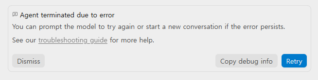
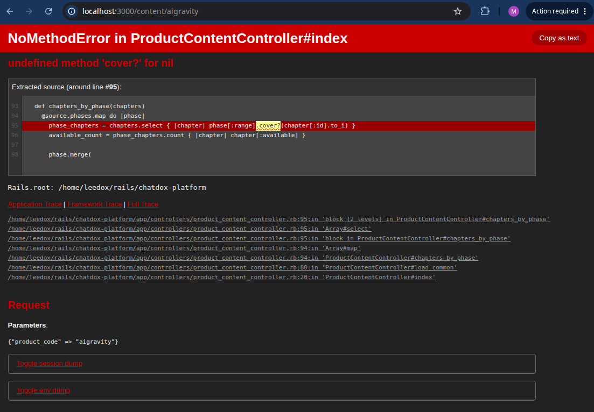

# 자율 디버깅과 자동화 테스트: 에러 발생 시 자율 수정 루프

> **Phase 4: 자율 디버깅 & 배포 자동화**  
> **Key Objective**: 터미널 샌드박스에서 테스트 명령을 직접 실행하고, 빌드 에러나 테스트 실패 로그를 에이전트가 읽어 자율 수정(Self-Correction)하도록 지휘하는 디버깅 루프를 구축한다.

---

## 📖 1. 자율 디버깅 루프 (Self-Correction Loop)

개발자가 로그를 복사해서 질문하는 시대는 끝났습니다. 에이전트가 직접 테스트를 돌리고 스택 트레이스(Stack Trace)를 읽어 원인을 자율 교정하게 합니다.

```text
[코드 수정] ──► [터미널 테스트 실행] ──► [에러 로그 감지] ──► [원인 분석 & 자율 수정] ──► [테스트 통과]
```

---

## 🖼️ 2. 실전 트러블슈팅 케이스 (.local/img 비하인드)

### 🐛 케이스 1: GUI 에이전트 오류 팝업 감지


- **[0011.png](images/0011.png)**: 구동 중 발생한 에이전트 내부 에러 팝업 비하인드.

### 🐛 케이스 2: `ProductContentController#index` 500 런타임 예외 (`cover? for nil`)


- **[0012.png](images/0012.png)**: `content_meta.yml` 내 `range` 파싱 시 `phase[:range]` 미지정으로 발생했던 `NoMethodError (undefined method 'cover?' for nil:NilClass)` 500 에러 스크린샷.
- **자율 디버깅 해결**: `ProductContentController` 내 `return [] unless phase[:range]` 수습 가드를 선제 반영하여 런타임 예외 100% 차단!

---

## 🔤 3. Core English Definition (본질 개념 정리)

> **Core English Definition**: *Self-Correction Loop (자율 수정 루프)*
> - **Simple Definition**: An automated process where the AI runs tests, analyzes failure logs, and fixes its own code until tests pass.
> - **Practical Meaning**: 에러가 나더라도 개발자가 일일이 개입하지 않고, 에이전트가 샌드박스 환경에서 에러 로그를 읽고 스스로 디버깅하여 초록색 테스트 통과(Pass)를 만들어내는 자율화 기술.

---

## 🛠️ 4. 실습 과제: 자율 디버깅 루프 실행

```bash
# 프롬프트 예시
"bin/rails test (또는 npm test)를 돌리고, 실패하는 단위 테스트를 스스로 읽어서 완벽히 통과할 때까지 자율 수정해 줘."
```

---

## 🔗 다음 에피소드 안내
- **11 (정규)**: [GitHub MCP & 자동화 파이프라인: 무중력 릴리즈와 상품화](/content/aigravity/11)

