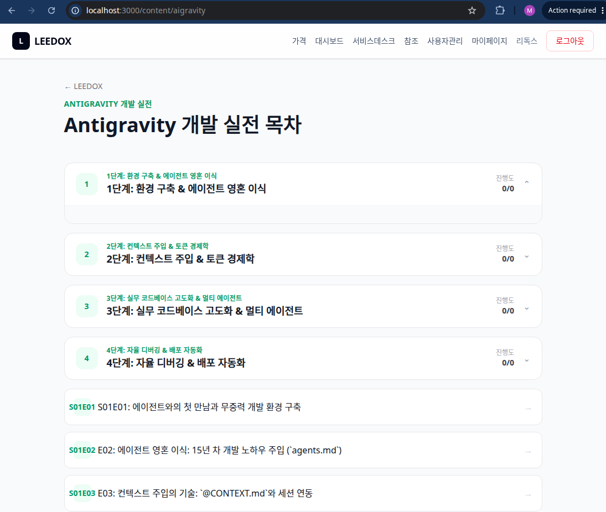

# GitHub MCP & 자동화 파이프라인: 무중력 릴리즈와 상품화

> **Phase 4: 자율 디버깅 & 배포 자동화**  
> **Key Objective**: GitHub MCP 연동을 통해 이슈 분석부터 커밋, PR 생성, 배포까지 무중력으로 자동화하고, 완성된 커리큘럼을 `platform` 교육 상품으로 성공적으로 런칭한다.

---

## 📖 1. GitHub MCP 및 상품화 파이프라인 (GitHub MCP & Productization)

자연어 한 줄 명령으로 GitHub Issue 분석부터 코드 수정, Commit/Push, PR 생성을 매끄럽게 연결합니다. 그리고 개발된 콘텐츠는 `content_meta.yml` 기반으로 `platform`에 배포되어 새로운 수익 창출 상품으로 탄생합니다.

---

## 🖼️ 2. 프로덕션 렌더링 런칭 성공 (.local/img 0013)

- **[0013.png](images/0013.png)**: `http://localhost:3000/content/aigravity` 화면에 4개 Phase 및 에피소드 아코디언이 에메랄드 테마로 완벽하게 런타임 렌더링된 감격의 런칭 현장!

---

## 🔤 3. 핵심 용어 정리 (Core Terms)

> **Core English Definition**: *GitHub MCP Integration (GitHub MCP 연동)*
> - **Simple Definition**: Connecting GitHub repository operations (issues, pull requests, commits) directly to the AI agent.
> - **Practical Meaning**: 터미널이나 웹사이트에 들어가지 않고 대화창에서 자연어로 "이슈 #10 해결하고 PR 올려줘"라는 지시 한 줄로 배포 파이프라인 전체를 처리하는 무중력 통합 기술.

> **Core English Definition**: *Educational Productization (교육 상품화)*
> - **Simple Definition**: Turning real-world development processes and logs into marketable educational courses.
> - **Practical Meaning**: 실무 개발 경험과 노하우를 일회성 작업으로 날리지 않고, OSMU 규격 문서로 정돈하여 다른 개발자들에게 전달 가능한 고가치 교육 상품으로 패키징하는 과정.

## 🎓 4. GitHub MCP 자동화와 상품화 요약 (Summary)

GitHub MCP와 자동화 파이프라인을 구축하여 이슈 분석부터 PR 발행, 그리고 `content_meta.yml` 기반의 교육 상품 런칭까지 무중력으로 완수했습니다. 실무 개발 경험을 고가치 교육 콘텐츠로 전환하는 강력한 에이전틱 워크플로우가 완성되었습니다! 🚀

